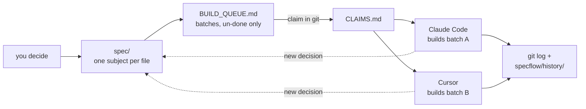

<!--
AI AGENTS: if you were asked to "install specflow", "set up specflow", or "apply specflow"
to a repo, skip to the "For AI agents" section near the bottom of this file. It carries the
exact ordered steps, the questions to ask the user first, and the post-install handoff.
Then read AGENTS.md in the target repo, which is the real protocol. This README is the pitch.
-->

<div align="center">

# specflow

**Spec-driven design for AI coding agents.**
**Your agents forget everything between sessions. specflow makes that not matter.**

[](https://github.com/MatanKoby/specflow/actions/workflows/ci.yml)
[](https://github.com/MatanKoby/specflow/releases/latest)
[](LICENSE)

[Quick start](#quick-start) · [Why](#why-specflow) · [How it works](#how-it-works) · [File map](#what-it-puts-in-your-repo) · [Agents](#agents) · [For AI agents](#for-ai-agents)

</div>

```console
$ specflow init

  Which agents will work in this repo?
    [x] Claude Code   [x] Cursor   [ ] Copilot   [ ] Bob   [ ] Antigravity

  Will create 16 files
    AGENTS.md              the protocol every agent reads first
    spec/                  your design, one subject per file
    BUILD_QUEUE.md         work declared as batches
    CLAIMS.md              who is building what, right now
    specflow/              procedures, config, history
    CLAUDE.md  .cursor/rules/specflow.mdc

  specflow installed. Nothing was committed.
  Review with `git diff`, remove anything you don't want, then commit.

$ claude "read AGENTS.md and claim a batch"

  Reading AGENTS.md ... claiming Batch 3 (auth flow).
  Reading spec/auth.md (94 lines). Not reading the other 6 spec files.
```

Write the design down as small, single-subject files in your repo. An agent reads the one file its
task needs instead of exploring your codebase, and every decision you make lands in those files the
moment you make it. So the conversation stops being where your project lives: compact or clear
whenever you want, switch from Claude Code to Cursor mid-project, come back a week later, and the
next agent picks up from the repo.

All plain markdown and git. One binary, no runtime, no service.

## Why specflow

**Your agents forget. The repo doesn't.**
Spec, queue, claims, and `git log` all live on disk. Nothing that matters is in the transcript, so a
context reset, a crash, or a new agent costs you nothing. At the end of every batch the agent hands
the context back and tells you it's safe to clear.

**Agents stop re-deriving decisions you already made.**
The `spec-edit` procedure fires the moment you settle something, not at the end of a feature. The
decision is written down before the next agent can quietly contradict it.

**Fewer tokens per task, where the spec covers the ground.**
Reading a 100-line spec file beats grepping twenty source files to reconstruct intent, and
single-subject files mean the agent loads one of them rather than your whole design. On unspecced
areas it still reads code. specflow doesn't pretend otherwise.

**One protocol, every agent, and more than one at a time.**
`AGENTS.md` is the universal base and each agent gets a native adapter. Batches are claimed in git
*before* any code is written, so Claude Code can build batch A while Cursor builds batch B on the
same branch without colliding.

**It asks more and assumes less.**
It stops and asks when new work contradicts existing code, asks permission before crawling unspecced
files, surfaces design forks instead of deciding quietly, and stops when a spec file crosses 600
lines rather than splitting it on its own authority.

> **Honest about enforcement:** these are written guidelines the procedures give your agent, not
> enforcement. Nothing executable checks them yet. Compliance depends on your agent actually
> following its instructions, which in practice is good but not guaranteed.

## Install

specflow is a single statically-compiled binary. **No runtime (Node, Python, ...) required.**

```bash
# Prebuilt binary, no Go needed (Linux & macOS):
curl -fsSL https://raw.githubusercontent.com/MatanKoby/specflow/main/install.sh | sh
```

This detects your OS/arch, downloads the matching binary from the latest
[GitHub Release](https://github.com/MatanKoby/specflow/releases), verifies its checksum, and installs
it to `/usr/local/bin` (falling back to `~/.local/bin`). Pin a version with
`SPECFLOW_VERSION=v0.1.3`, or change the target with `SPECFLOW_INSTALL_DIR=...`.

```bash
# Or, if you already have Go:
go install github.com/MatanKoby/specflow/cmd/specflow@latest
```

Windows binaries are attached to each release. **Homebrew** (`brew install`) is coming.

**What it does to your repo:** writes markdown files, wraps its own content in
`<!-- specflow:start -->` / `<!-- specflow:end -->` markers, never touches text outside them, and
**never commits**. It requires a git repo precisely so `git diff` is your undo. To uninstall, delete
the files.

## Quick start

```bash
specflow init                          # interactive, pick your agents
specflow init --agents=claude,cursor   # non-interactive
specflow init --all                    # every supported agent
specflow init --spec-only              # spec discipline only, no queue or claims
specflow init --dry-run                # preview, writes nothing
```

Then review `git diff`, commit the install as its own commit, and point your agent at the protocol:

```bash
git add -A && git commit -m "meta: install specflow"
specflow verify                        # confirm the install is intact
```

> Ask your agent: *"Read `AGENTS.md`, then let's spec the first feature."*

## How it works

Four moves, and the repo records all of them.

1. **Spec.** You decide something. It goes into the one file in `spec/` whose subject matches.
2. **Queue.** Work that flows from the decision is declared in `BUILD_QUEUE.md` as a batch.
3. **Claim.** Before writing any code, the agent claims the batch in `CLAIMS.md` and commits that
   claim, so a second agent can see it and take a different one.
4. **Build, then finish.** The agent builds, commits with a `batch-N:` prefix, moves the batch into
   history, and offers to hand the context back. A new decision along the way loops to step 1.



The golden rule underneath it: **the queue declares work, the claims file records execution state.**
They never mix, which is why you can rewrite `BUILD_QUEUE.md` at any time without breaking anything
an agent is doing.

## What it puts in your repo

A fresh `init` with Claude Code and Cursor selected writes 16 files:

```
your-repo/
├── AGENTS.md                  the protocol every agent reads first     [specflow]
├── BUILD_QUEUE.md             work declared as batches, un-done only   [you]
├── CLAIMS.md                  who is building what, right now          [agents]
├── spec/                      the design, one subject per file         [you]
│   └── README.md                the index, and all you start with:
│                                architecture.md, api.md, and the rest
│                                appear as you decide things
├── specflow/
│   ├── procedures/              claim-batch · spec-edit · finish-batch · prune-ledgers  [specflow]
│   ├── config.json              your choices and the version stamp
│   └── history/                 completed batches, retired claims       [agents]
│
└── one adapter per agent you picked                          [specflow region]
    ├── CLAUDE.md                points Claude Code at AGENTS.md
    ├── .claude/skills/          the four procedures, auto-triggering
    ├── .claude/hooks/           the opt-in end-of-batch handoff backstop
    └── .cursor/rules/           points Cursor at AGENTS.md
```

`spec/` starting nearly empty is the design, not an omission: it grows to cover what you actually
work on, one subject at a time.

| Path | Role | Owner |
|---|---|---|
| `AGENTS.md` | The full protocol every agent reads first | specflow (refreshed on upgrade) |
| `specflow/procedures/*.md` | The four procedures (claim / spec-edit / finish / prune) | specflow (refreshed on upgrade) |
| `specflow/config.json` | Config + state (agents, mode, versions, region hashes) | specflow |
| `BUILD_QUEUE.md` + `specflow/history/BUILD_QUEUE_DONE.md` | Work declaration + completed history | you |
| `CLAIMS.md` + `specflow/history/CLAIMS_DONE.md` | Execution-state ledger | agents |
| `spec/` | Your design, concern per file | you |
| per-agent stubs (`CLAUDE.md`, `.cursor/rules/...`) | Point each agent at `AGENTS.md` | specflow region, your text preserved |

The boundary is deliberate: **specflow owns the mechanism, you own the content and state.** That is
what makes `upgrade` safe.

## Agents

| Agent | What it writes |
|---|---|
| **Claude Code** | `CLAUDE.md` + `.claude/skills/{claim-batch,spec-edit,finish-batch}` (auto-triggering) |
| **Cursor** | `.cursor/rules/specflow.mdc` |
| **GitHub Copilot** | `.github/copilot-instructions.md` |
| **IBM Bob** | `.bob/rules/specflow.md` (Bob also reads `AGENTS.md` natively) |
| **Google Antigravity** | `.agents/rules/specflow.md` (Antigravity reads `AGENTS.md` natively) |

`AGENTS.md` is always written as the universal base, so any agent that reads it is covered even
without a dedicated stub. Add one later with `specflow add-agent cursor`.

## Who it's for

Best when you're **starting a new project** or working in a **small repo**, solo or a small team.
Medium and large repo optimization is explicitly not in scope yet.

The spec has to come from a human who knows the code. specflow does not backfill it for you. On a new
project that's effortless and compounds as you go. On an existing repo it's a **one-time investment**:
spec an area just before you work it, and the coverage grows to fit what you actually touch.

<details>
<summary><b>Upgrade, status, and verify</b></summary>

```bash
specflow status      # version, mode, agents, levers, queue depth, active claims, drift
specflow upgrade     # refresh the managed mechanism, bump the stamp
specflow verify      # check install integrity, file by file
specflow add-agent copilot
```

`upgrade` refreshes only specflow's own marker-delimited regions (`AGENTS.md` and
`specflow/procedures/`). Your queue, claims, and spec are never touched.

If you edited inside a managed region, `upgrade` detects the drift by hash, leaves your version
alone, and writes the fresh one to a `<file>.specflow-new` sidecar rather than clobbering you. The
stamp's `schemaVersion` gates future state-file migrations. None exist yet, and the file contract is
kept stable on purpose so they stay rare.

</details>

<details>
<summary><b>Spec-only mode</b></summary>

`specflow init --spec-only` installs the spec discipline alone: agents create, update, and organize
`spec/` as a concern-per-file hierarchy, split files that grow two subjects, and archive stale
content, all behind a propose-then-approve gate. It writes no `BUILD_QUEUE.md`, no `CLAIMS.md`, and
no claim or finish procedures.

It is a lighter on-ramp and it can graduate to full later. Generated files never mention machinery
the mode didn't install, and `specflow verify` checks that.

</details>

## How it differs

specflow shares a neighborhood with GitHub Spec Kit, Amazon Kiro, OpenSpec, and BMAD-METHOD. All of
them get design written down before code. The difference is what happens afterward: those run a
phased flow that produces a spec for a feature, while specflow treats the spec as a permanent part of
the repo that many agents read from and write to over months. That is why it optimizes for different
things: small files an agent loads one of, a git-arbitrated queue two agents can work in parallel,
and a rule that fires every time you make a decision rather than once at the start of a feature.

## For AI agents

*If you are an AI coding agent and someone asked you to "install specflow", "set up specflow", or
"apply specflow to this repo", follow these steps exactly.*

**1. Confirm you are in a git repository.** specflow refuses to run outside one, because reviewing
`git diff` is the user's only undo.

```bash
git rev-parse --is-inside-work-tree || git init
```

**2. Install the binary.** Prefer the release script. Fall back to `go install` only if Go is
present and the script fails.

```bash
curl -fsSL https://raw.githubusercontent.com/MatanKoby/specflow/main/install.sh | sh
specflow --version
```

**3. Ask the user two questions before running `init`. Do not guess.**
- **Which agents** will work in this repo? Valid keys: `claude`, `cursor`, `copilot`, `bob`,
  `antigravity`.
- **Full or spec-only?** Full (default) installs spec + queue + claims + the batch protocol.
  Spec-only (`--spec-only`) installs just the spec discipline, with no queue or claim machinery.

**4. Run `init` non-interactively** with their answers:

```bash
specflow init --agents=claude,cursor      # add --spec-only if they chose that
```

**5. `init` does not commit, on purpose.** Show the user what changed, tell them they can remove
anything they don't want (with the caveat that specflow may not work properly if required pieces go),
then commit the install as its own commit before any batch work:

```bash
git status && git diff
git add -A && git commit -m "meta: install specflow"
specflow verify                            # confirms the install is intact
```

**6. Claude Code only: relay the handoff hook.** `init` drops the hook script at
`.claude/hooks/specflow-handoff-reminder.sh` and prints the settings block that activates it. The
hook is **opt-in**, so it does nothing until the user merges that block in. Do not leave this buried
in CLI scrollback. Tell them the exact block, and tell them why: it is a deterministic backstop that
blocks the loop right after a `meta: complete batch-*` commit so the end-of-batch context handoff
gets offered every time, instead of depending on the agent remembering to.

Merge into `.claude/settings.json` (commit it, so the whole team's agents get the backstop), or
`.claude/settings.local.json` for a personal, uncommitted setup:

```json
{
  "hooks": {
    "PostToolUse": [
      {
        "matcher": "Bash",
        "hooks": [
          { "type": "command", "command": "bash ${CLAUDE_PROJECT_DIR}/.claude/hooks/specflow-handoff-reminder.sh" }
        ]
      }
    ]
  }
}
```

**7. Read `AGENTS.md` before doing any work.** It is the full protocol and it is the single source of
truth, not this README. The four procedures live in `specflow/procedures/`. Do not claim a batch or
edit anything under `spec/` before reading the matching procedure.

**Upgrading an existing install** is `specflow upgrade`, then relay step 6 again if the user is on
Claude Code. Check the current state first with `specflow status`.

## License

MIT
